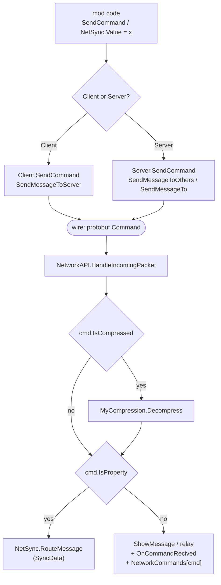
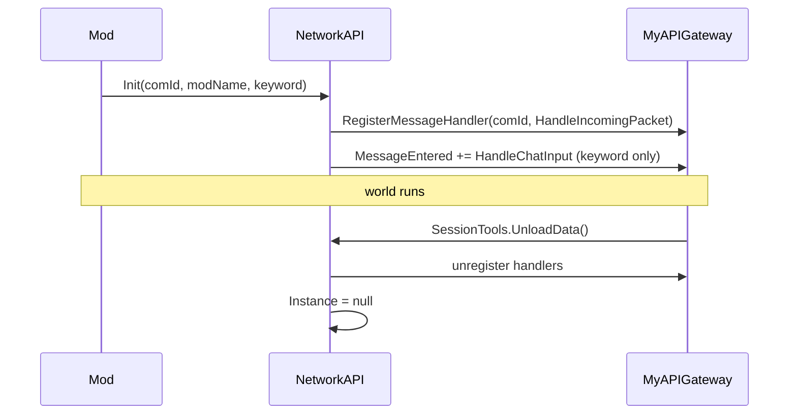

# Architecture

SENetworkAPI is a thin, opinionated wrapper over the two networking primitives
Space Engineers gives a mod:

* `MyAPIGateway.Multiplayer.RegisterMessageHandler(ushort, Action<byte[]>)`
* `MyAPIGateway.Multiplayer.SendMessageTo*(ushort, byte[], ...)`

Everything else — command dispatch, chat commands, per-variable syncing — is
built on top of a single packet type travelling on a single channel.

## The pieces

| File | Type | Responsibility |
| --- | --- | --- |
| `Network.cs` | `NetworkAPI` (abstract) | Channel ownership, command registries, receive path, chat parsing |
| `Client.cs` | `Client : NetworkAPI` | Send path for a client (everything goes to the server) |
| `Server.cs` | `Server : NetworkAPI` | Send path for a server (broadcast, targeted, positional) |
| `Command.cs` | `Command` (internal) | The one and only wire envelope |
| `NetSync.cs` | `NetSync` / `NetSync<T>` / `SyncData` | Per-variable syncing built on `Command` |
| `SessionTools.cs` | `SessionTools` | Session component that tears the API down on world unload |

## Roles

`NetworkAPI.Init(comId, modName, keyword)` picks the concrete class from the
game state, once:

```csharp
if (!MyAPIGateway.Multiplayer.IsServer) Instance = new Client(...);
else                                    Instance = new Server(...);
```

A listen server (a player hosting) and a dedicated server both get `Server`;
they differ only in whether `MyAPIGateway.Utilities.IsDedicated` is set and
whether `MyAPIGateway.Session.Player` exists.

> The `NetworkTypes { Dedicated, Server, Client }` enum in `Network.cs` is
> declared but never used, and there is no `NetworkType` property. To branch on
> role use `NetworkAPI.Instance is Server` or `MyAPIGateway.Multiplayer.IsServer`.

## Packet flow



Every mod using the API owns one `ushort` communication channel. All traffic
for that mod — commands, chat relays and every synced property — shares it.

## Two ways to talk

**Commands** are explicit request/response messaging. You register a callback
under a name and send that name with an optional payload:

```csharp
Network.RegisterNetworkCommand("update", ServerCallback);
Network.SendCommand("update", data: MyAPIGateway.Utilities.SerializeToBinary(config));
```

**Properties** (`NetSync<T>`) are declarative. You declare a variable, assign to
it, and the value appears on the other side. Internally each assignment becomes
a `Command` with `IsProperty = true` carrying a `SyncData` payload.

See [networkapi.md](networkapi.md) and [netsync.md](netsync.md) for the details.

## Lifecycle



`SessionTools` is a `MySessionComponentBase` shipped inside the API, so simply
including these files gives you the teardown. `Close()` and `Dispose()` are
marked obsolete because you are not expected to call them yourself.

## State that lives across the session

All of it is static, and all of it is per-mod: Space Engineers compiles each
mod into its own assembly, so two mods including these sources get two
independent sets of statics (and should still choose different `comId`s,
because the channel is shared game-wide).

| Static | Lives in | Holds |
| --- | --- | --- |
| `NetworkAPI.Instance` | `Network.cs` | The single `Client`/`Server` for this mod |
| `NetworkAPI.LogNetworkTraffic` | `Network.cs` | Verbose logging switch |
| `NetSync.PropertiesByEntity` | `NetSync.cs` | Entity-scoped properties, addressed by declaration order |
| `NetSync.PropertyById` | `NetSync.cs` | Session-scoped properties, addressed by a generated id |
| `NetSync.generatorId` | `NetSync.cs` | Counter behind those generated ids |

Because addressing depends on declaration order and on a shared counter, both
sides of the connection must run the *same build of the mod*. See
[netsync.md](netsync.md#addressing).
